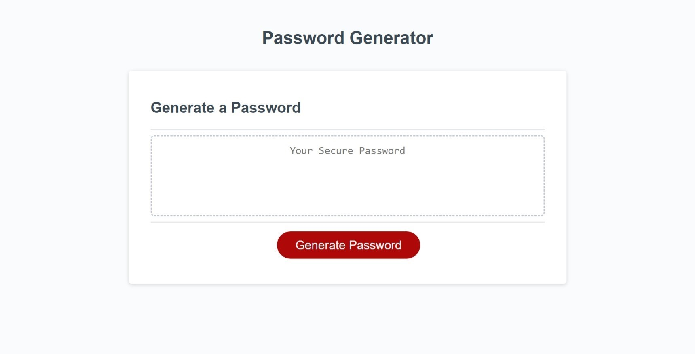

# Password-Generator
Simple password generator in web browser

**Generator Criteria:**
- Lenght of password character (1-128)
- Uppercase characters
- Lowercase characters
- Numerical characters
- Special characters

## Link
Link: [Password Generator](https://robertsolorzano.github.io/Password-Generator/)

## Preview

## Credits

**Sources for Studying**

[JavaScript Random](https://www.w3schools.com/JS/js_random.asp)

[Markdown Cheet Sheet](https://www.markdownguide.org/cheat-sheet/)

## License

Please refer to the LICENSE in the repo.